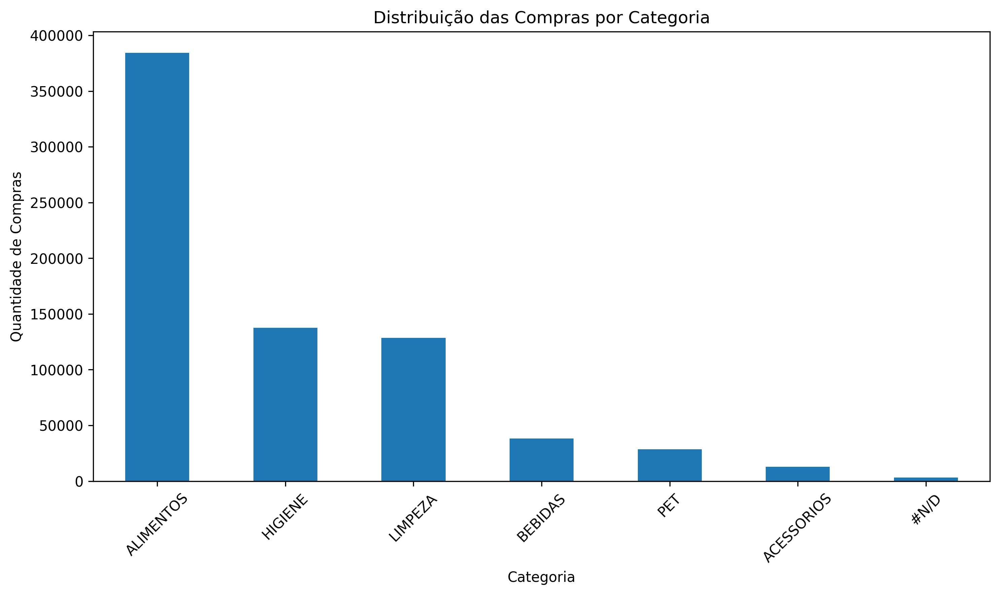

# Mini-Projeto Avaliativo - Análise de Dados com Python SCtec/Senai

## Aluno

Vanderson Luiz C. Martins

## Turma

T2

---

## Objetivo

Realizar uma Análise Exploratória de Dados (AED) utilizando a base de Varejo disponibilizada para a disciplina.

O projeto contempla:

- Importação dos dados;
- Identificação de problemas na base;
- Limpeza de dados;
- Tratamento de nulos e duplicatas;
- Conversão de tipos;
- Estatística descritiva;
- Agrupamentos utilizando Pandas;
- Exportação da base limpa.

---

## Estrutura do Projeto

```text
Miniprojeto_Vanderson_Luiz_Turma2/

── raw/
   └── Base_Varejo.csv

── output/
   └── df_limpo.csv

── Miniprojeto_SCtec.py

── LICENSE

── README.md
```

## Tecnologias Utilizadas

- Python 
- Pandas
- VS Code

## Como Executar

```bash
python Miniprojeto_SCtec.py
```

---

## Limpeza Realizada

- Remoção de colunas totalmente vazias;
- Conversão da coluna DATA para datetime;
- Remoção de registros duplicados;
- Tratamento da coluna CL_FHL;
- Verificação de categorias vazias.

---

## Estatística Descritiva

Foi realizada análise da coluna:

**CL_FHL (Número de Filhos)**

Métricas calculadas:

- Média
- Mediana
- Moda
- Desvio padrão
- Mínimo
- Máximo
- Quartis
- Contagem

---

## Conclusões

Após a análise exploratória foi possível identificar:

- Existência de colunas completamente vazias.
- Presença de registros duplicados.
- Necessidade de conversão da coluna DATA.
- Diferenças na distribuição de compras por gênero.
- Concentração de vendas em determinadas categorias.
- Importância do tratamento dos dados antes de análises futuras.

---

## Insights

1. A maioria dos clientes não possui filhos
Estatísticas da coluna CL_FHL (Número de Filhos):

- Média: 1,15 filhos
- Mediana: 0 filhos
- Moda: 0 filhos
- Máximo: 4 filhos

Embora exisa uma parcela significativa com 2 ou mais filhos, grande parte dos cliente cadastrados não possui filhos.

2. Distribuição das compras por gênero

Gênero	                   Compras
- Feminino (F)	           382.427
- Masculino (M)	           351.020

O público feminino representa aproximadamente 52,1% das compras registradas.
Contudo, o comportamento de compra é relativamente equilibrado entre homens e mulheres, mas há uma leve predominância do público feminino.

3. A categoria Alimentos domina as vendas

Categoria	               Quantidade
- ALIMENTOS                384.197
- HIGIENE	               137.702
- LIMPEZA	               128.632
- BEBIDAS	               38.264
- PET	                   28.553

Mais da metade das compras estão concentradas na categoria ALIMENTOS, demonstrando que produtos de consumo diário são os principais responsáveis pelo volume de vendas.

4. Clientes do Segmento B representam a maior parte da base
Distribuição por segmento:

Segmento	               Quantidade
- B	                       468.505
- C	                       205.265
- A	                       59.677

O Segmento B concentra aproximadamente 64% dos registros da base.
Isso sugere que o público-alvo predominante da empresa está nessa faixa de segmentação.

## Arquivos Gerados

- df_limpo.csv

## Distribuição das Compras por Categoria

O gráfico abaixo apresenta a quantidade de compras registradas para cada categoria de produto após o processo de limpeza dos dados.

